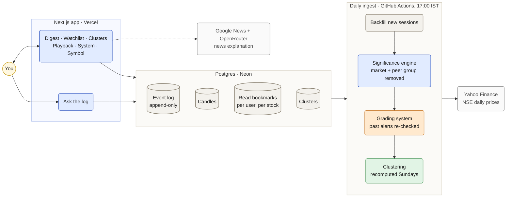

# Ledger

Most watchlists show current state and leave you to work out what
changed. Ledger shows the diff.

**1. Read cursor model.** Symbols write into an append-only event log;
each user holds a per-symbol read offset. "What's new" is everything
after that offset — computed on read, not fetched as current state and
diffed in the UI. Reading advances the cursor explicitly, never
implicitly, so multi-device sync and "since you last checked" fall
directly out of the data model rather than being bolted on (Section 6).

**2. Structural break, not price move.** A 12-stock watchlist is usually
three or four correlated bets, not twelve independent ones (Section 4's
clustering). A move fully explained by the market or the sector isn't
news — the unexplained residual is (Section 3). And the sharpest version
of that isn't "moved 5%," it's "this stock tracked its cluster for months
and just stopped." Most days, on a properly-clustered watchlist, nothing
clears that bar — and that's the product working, not a fallback screen
(Section 7's empty state is deliberately the most-designed screen in the
app, not an afterthought).

That's the pitch. Everything below is how it's built.

Stack: Next.js (App Router, TS) + Postgres, plain SQL — a separate
long-lived Node worker handles ingestion (Section 5).

## How it fits together



## Section 1 — Clock and quote abstraction

Everything that touches wall time or market data goes through two
interfaces (`src/lib/time/clock.ts`, `src/lib/quotes/quote-source.ts`), each
with a live driver and a replay driver, selected by `DATA_MODE`:

- `DATA_MODE=live` — `LiveClock` (real time, NSE hours) + `LiveQuoteSource`
  (polls Yahoo Finance, see below).
- `DATA_MODE=replay` — `ReplayClock` + `ReplayQuoteSource` stream the
  committed real historical dataset (`data/real-nse-history.json`, 220
  real NSE sessions) as if it were live. The clock only advances as the
  replay emits ticks, scaled by a speed multiplier — never from wall time.

Get both for the current mode from `src/lib/data-mode.ts`
(`createClock()`, `createQuoteSource(clock)`); no other module should reach
for `Date.now()`, `new Date()`, or `fetch` for market data directly.

```bash
npm install
npm run replay -- --speed 60   # streams every symbol's ticks to the console
npx tsc --noEmit
```

`LiveQuoteSource`'s primary source is Yahoo Finance —
`src/lib/quotes/yahoo-live-fetcher.ts` requests its public chart endpoint
directly (`https://query1.finance.yahoo.com/v8/finance/chart/<ticker>.NS`,
reading `meta.regularMarketPrice`/`regularMarketTime`), no API key needed.
`worker/sources.ts` documents where a second independent live vendor plugs
into the two-source conflict check (Section 5).

## Section 2 — Schema and event log

Postgres schema (`db/migrations/0001_init.sql`): `symbols`, `candles`,
`corporate_actions`, the append-only `events` log, `users`,
`watchlist_items`, `read_cursors`, `clusters` — a thin typed wrapper
(`db/client.ts`) plus one query module per table (`db/queries/*.ts`).

Three rules are enforced at the database level, not just by convention:

- **`events` is append-only.** `UPDATE`/`DELETE` on `events` are rejected
  by a trigger (`events_append_only()`), full stop — corrections are new
  rows referencing the prior id via `supersedes`.
- **Ingestion is idempotent.** `events` has a unique constraint on
  `(symbol, ts, kind)`; `appendEvent` inserts with `ON CONFLICT DO
  NOTHING` and returns `null` on a duplicate, so reprocessing a candle
  never creates a second event for the same thing.
- **Cursors only advance.** `ackCursor`'s upsert `DO UPDATE` is guarded by
  `read_cursors.last_event_id < EXCLUDED.last_event_id` — a stale write
  from a slow device is a silent no-op, never a rewind, never an error.

### Why this scales

Every table that costs real compute — `candles`, `corporate_actions`,
`events`, `clusters` — is keyed by `symbol` (and `session_date`), never by
user. `watchlist_items` is a plain `(user_id, symbol)` join table, and
`read_cursors` — the only per-user state tied to market data at all — is
one bigint offset per `(user_id, symbol)`.

That means ingestion, the significance engine, and clustering all run
**once per distinct symbol**, shared by every user watching it, not once
per user's watchlist. Adding the 10,000th guest account watching RELIANCE
costs one small `read_cursors` row — no extra polling, no re-run
significance check, no clustering recompute. Cost scales with the size of
the tracked symbol universe, not with `users × watchlist size`.

### Local Postgres

```bash
docker compose up -d db      # host port 5434
npm run db:migrate           # applies any .sql file not yet in schema_migrations
```

In production this points at Neon instead (see Deployment); nothing in
the app code changes, only `DATABASE_URL`.

## Section 3 — Significance engine

Pure function library, no I/O — `src/significance/`. Numbers in (a
symbol's own bars, the index's bars, its cluster's daily mean returns),
a score and a one-sentence explanation out.

The decomposition (`decompose.ts`):

```
observed_return = beta * index_return + cluster_excess + residual
cluster_excess  = cluster_return - beta * index_return
```

Substituting shows `residual = observed_return - cluster_return` — beta
cancels algebraically, on purpose (see the comment at the top of
`decompose.ts`): what's left over after removing "what the market did"
and "what the cluster did" is exactly the stock's deviation from its own
cluster's mean, which is what gets z-scored against its own rolling
residual volatility.

**Volume confirmation.** The z-score gets multiplied by a volume weight:
`max(0, 1 + ln(volumeRatio))`. At normal volume (ratio 1) that's ~1, so
the score is untouched; above-normal volume raises it; below about **37%
of normal volume** the weight hits **0** and wipes the score out entirely
— a big move on almost no trading never clears the bar. A symbol with no
real volume history yet (too newly listed) is treated as neutral (weight
1, judged on the residual alone) instead of letting a missing baseline
distort the score.

**Scoring version.** Every stored event carries `scoringVersion`
(`config.ts`'s `SCORING_VERSION`) — bumped whenever the scoring *formula*
changes, so a future formula change can never silently reinterpret an
old, already-persisted event under new math.

**What these numbers are.** A residual z-score is computed against a
stock's own trailing window (`residualStdevWindow`, default 60 sessions)
— a relative, self-referential measure ("how unusual is this for *this*
stock lately"), not a standardized volatility figure comparable across
symbols.

**Structural break.** A rolling correlation-to-cluster window compared
against every prior window of the same length in the available history.
Flagged when the current correlation falls sharply (`breakCorrelationDrop`)
below its own historical floor **and** the residual z-score clears a
(lower) bar of its own — a break needs both a broken relationship and an
actual move, not just noise in a short correlation window. When a day
qualifies as both a break and a plain residual move, the break wins.

## Section 4 — Clustering, with a mandatory fallback

`src/clustering/`, pure functions, no I/O — return histories in, cluster
assignments out. `clusterBySector` (needs no return history, always
succeeds) is the fallback; `clusterByCorrelation` is tried first, and
`computeClusters` is the single entry point everything else calls.

`clusterByCorrelation` returns `null` (triggering the fallback) when:

- **insufficient history** — fewer than `minHistoryDays` (default 90)
  sessions for any symbol. (A separate number from Section 3's volume
  window, which defaults to 20 sessions and only affects how confident a
  volume reading is — not whether clustering runs at all.)
- **degenerate output** — every "cluster" is still a singleton, meaning
  nothing found enough structure to merge at all.

Hierarchical merging is bounded by `maxMembers` (2-6) and also by
`maxMergeDistance` (default 0.7, i.e. won't merge below ~0.3 correlation)
— a size cap alone doesn't stop unrelated symbols from merging just
because there happens to be room, so the distance cutoff is a real
stopping criterion in its own right.

```bash
npm run sync-symbols        # upserts the active symbols into `symbols`
npm run clusters:recompute  # fetches history, caches into `clusters`
```

Meant to run weekly via a scheduled job in production — this script is
that job's body, never invoked on a read path.

## Section 5 — Ingestion worker and resilience

`worker/` — a standalone long-lived Node process (`npm run worker`), not a
Next.js route. Loop per symbol: pull from `QuoteSource` -> adjust for
corporate actions before any comparison -> write the candle (idempotent)
-> run the significance engine -> append events above threshold.

- **Corporate actions** (`corporate-actions.ts`) — `adjustBarsForCorporateActions`
  rescales both price and volume for every bar before an action's ex-date,
  so a 1:5 split never reads as an overnight -80% move. On the ex-date
  itself, the worker emits a `corporate_action` event and explicitly
  skips significance evaluation that day.
- **Two-source conflict** (`reconcile.ts`) — polls primary and secondary,
  and marks the day `confirmed: false` rather than silently picking one
  when they disagree beyond tolerance (1%, default). Unconfirmed days are
  still written (the raw print happened) but significance evaluation is
  skipped for them.
- **Freshness** (`freshness.ts`) — every candle carries its source and
  timestamp for the read path to classify how current it is.
- **Stale alerts** (`stale-alerts.ts`) — `checkForResolution` compares a
  prior flagged move's baseline/trigger price against the current price;
  a large-enough reversal emits a follow-up `event_resolved` event
  (`supersedes` the original) instead of leaving the original alert as
  the last word.
- **Tiered polling** (`polling-tiers.ts`) — `pollingTierFor(watcherCount)`
  maps watchlist membership to hot/warm/cold poll intervals, so a symbol
  nobody's watching isn't polled as often as one everyone is.
- **Backpressure** (`backpressure.ts`) — `IntervalRunner` is the timer
  each symbol runs on. If a tick's own ingestion work is still running
  when the next tick comes due, it skips that tick and logs the gap,
  rather than starting a second overlapping run — a slow symbol falls
  behind on its own polling instead of piling up concurrent work.

Two things worth knowing about how ingestion actually runs:

- Postgres `date` columns are parsed as plain `'YYYY-MM-DD'` strings, not
  JS `Date` objects (`db/client.ts`) — every date comparison in the
  codebase assumes that shape.
- A worker call backfills *every* session newer than what's already
  stored for that symbol, in chronological order — not just "today" — so
  it can bootstrap a fresh database or catch up after downtime and still
  see every corporate action and conflict on the day it actually happened.

Every `candles` row also records which `DATA_MODE` produced it, and every
symbol's most recent ingestion result — including quiet outcomes that
produce no event, like "insufficient cluster history" — is mirrored to
`ingest_status` and shown on `/system`.

## Section 6 — Read path and cursors

The read path is Next.js Server Components and API routes, reading
straight from `db/queries/*`.

**`GET /api/digest?user_id=1`** — every event since the user's cursor,
per watchlisted symbol, hierarchically compacted, plus each symbol's
current cursor position. **Never advances a cursor** — reading is
explicit, via a separate ack.

**`POST /api/cursor/ack`** — body `{ user_id, symbol, up_to_event_id,
device_id }`. Advances the cursor monotonically only — a lower id from a
stale/out-of-order device is a silent no-op, not an error.

### Hierarchical compaction

`src/digest/compact.ts`, a pure function, no I/O:

- **Latest session** — individual events, full detail, newest first.
  Anchored to the newest ingested trading session, not "the last 24
  hours" — daily bars land after the close, so a wall-clock rule emptied
  this tier by the next morning. It's the only tier whose cards carry a
  decomposition (metrics, breakdown, Hindi).
- **Within 7 days** ("episode") — every price-move event for a symbol in
  this window merges into one narrative: *"TCS drifted down 6.0% over 3
  sessions."*
- **> 7 days** ("chapter") — every price-move event for a symbol, no
  matter how many or how old, collapses into exactly one line with the
  net change: *"TCS: 3 moves flagged, net down 3.2% since 2026-07-29."*
  This is what makes "someone gone 4 months" safe to show.

Two more rules: a resolved move folds into a single item showing the
*resolved* text, never a live-looking alert followed by a separate
resolution line — and a corporate action never merges into a price-move
narrative, since folding "1:5 split" into a drift percentage would be
actively misleading.

Cursors are genuinely independent per `(user, symbol)` — acking one
symbol never touches another's cursor, an out-of-order/stale ack is
ignored rather than rewinding a newer one, and removing then re-adding a
symbol resumes from wherever its cursor already was rather than dumping
the full backlog again.

| Case | What happens | Why |
| --- | --- | --- |
| An event lands after a client already fetched a digest snapshot | The next fetch includes it — nothing was missed | `GET /api/digest` never advances the cursor; only an explicit ack does |
| The same device acks the same event twice | Second ack is a silent no-op, cursor unchanged | `ackCursor`'s upsert only updates when the new value is *higher* |
| An old tab acks after a newer ack already landed (out-of-order) | The old tab's lower value is ignored; the higher cursor stands | The guard is `last_event_id < EXCLUDED.last_event_id`, enforced by Postgres |
| A symbol is removed from the watchlist, then re-added later | Its cursor row is untouched by removal, so re-adding resumes from where it left off | `read_cursors` is keyed by `(user_id, symbol)`, independent of `watchlist_items` |
| Two different users watch the same symbol | Fully independent — one acking never affects the other | Cursor is per `(user_id, symbol)`, not per symbol |

## Section 7 — Frontend

Six screens: digest (home), watchlist, clusters, playback, system, plus
a per-symbol detail page. Server Components fetch data straight from
`db/queries/*`; client components exist only where a page actually needs
interactivity, talking to Section 6's read path.

**Design.** The palette and type system come from the product's own
metaphor: `accent #2B3A67` is a deep ink-indigo — "ledger blue" — on a
warm ledger-paper ground, hairline rules instead of card shadows.
`Newsreader` (serif) for the plain-sentence headline every card leads
with, `IBM Plex Sans` for nav/labels, `IBM Plex Mono` with tabular
figures for prices and percentages. Both light and dark themes are fully
specified.

**The empty state** gets the most deliberate space in the app —
centered, generous padding, a single quiet mark, no error or loading
styling: *"Nothing needs you today."*

**Cluster view** is one hand-built inline SVG, no chart library: each
cluster's members scatter in a loose ring around a labelled center, and
any symbol with a recent flagged move drifts further out and picks up a
semantic color.

**Symbol detail** shows freshness and confirmation states as a small
muted marker next to the as-of date, never a loud banner.

**Auth** is cookie-based (`src/lib/current-user.ts`, `app/api/auth/*`):
guest sign-in, or signup/login with a username and password, hashed
before storage. `user_id` is read from the session cookie server-side on
every request. A signed-out visitor falls back to a fixed demo user so a
direct or bookmarked link never breaks.

## Inspectability

Two features make a claim the UI already makes into something a viewer
can verify on the spot instead of taking on faith:

- **"Show me anyway"** on the empty state re-runs the real decomposition
  for every watchlisted symbol's latest session and shows the actual
  residual z-score and volume ratio, whether or not either cleared the
  bar — "12 symbols, all quiet" becomes a list of numbers, not a claim.
- **"Why grouped?"** on the symbol page shows the real pairwise
  correlation between a symbol and each cluster peer, sorted strongest
  first — or an honest note when the cluster came from the sector
  fallback instead of real correlation clustering.
- **Ingestion outcomes** on `/system` shows every symbol's most recent
  ingestion result, including outcomes that never produce an event —
  distinguishing "nothing happened" from "nothing happened *that we could
  see*."

## Deployment

**Vercel** for the Next.js app, **Neon** for Postgres, and a **daily
scheduled GitHub Action** (`.github/workflows/daily-ingest.yml`) for
ingestion. The standalone long-lived worker (`npm run worker`) still
exists and still works, with a ready `railway.json` — it's just not what
runs in production day to day.

**Why ingestion moved off an always-on worker.** The worker polls every
5s/30s/5min, forever — Railway bills for that continuously even though
there's nothing to ingest outside the ~6h15m NSE session, and a worker
holding a connection pool open keeps Neon's free-tier compute awake
around the clock instead of scaling to zero. The daily job connects,
backfills real Yahoo sessions newer than the `candles` watermark, grades
past alerts, recomputes clusters on Sundays, and exits.

What that costs: sub-minute tiered polling isn't running in production.
The tiered-polling code, its tests, and the `/system` page that shows
each symbol's tier are unchanged and still run locally — the daily job
just lands each session's real close about 90 minutes after the bell
instead of ticking through the day. For a window that genuinely needs
live ticks, the worker can be run on demand from a laptop pointed at the
same Neon database, or redeployed to Railway from `railway.json`.

Because `ingestSymbol` backfills from the watermark rather than from
"today", missed runs self-heal on the next one, and re-running the job is
a no-op. The backfill script isolates failures per symbol and only exits
non-zero when every symbol fails, so one individually unresolvable ticker
doesn't turn a whole scheduled run red.

`DATA_MODE=live` in production — real Yahoo data, ingested daily.
`DATA_MODE=replay` exists for local development and for streaming the
committed historical dataset without hitting Yahoo.

**What the deployment model assumes.** One ingestion process at a time
(the daily job, or the worker when run on demand) plus one durable
Postgres:

- Every stateful thing — candles, events, cursors, clusters — lives in
  Postgres, not in the worker process's memory.
- Multiple worker replicas wouldn't corrupt data (every write is
  idempotent) but wouldn't add capacity either — `IntervalRunner`
  schedules one timer per symbol per process, so identical replicas just
  poll the identical symbol set twice. Scaling ingestion needs sharding
  the symbol list across workers, not more copies of the same one.

### Steps

**1. Neon** — create a project, copy the pooled connection string
(`...-pooler.neon.tech`, `?sslmode=require`) into `DATABASE_URL`.

**2. One-time setup, run locally against the Neon URL:**

```bash
DATABASE_URL="<neon-pooled-url>" npm run db:migrate
DATABASE_URL="<neon-pooled-url>" npm run sync-symbols
DATABASE_URL="<neon-pooled-url>" npm run sync-corporate-actions
DATABASE_URL="<neon-pooled-url>" DATA_MODE=live npm run clusters:recompute
```

**3. Daily ingestion (GitHub Actions)** — add a repository secret named
`DATABASE_URL` with the Neon connection string. The workflow runs daily
at 11:30 UTC (17:00 IST, after the close); trigger it once by hand from
Actions → Daily ingest → Run workflow to confirm it goes green.

**4. Vercel (app)** — import this repo; it reads `vercel.json`. Set
`DATABASE_URL` (the Neon **pooled** string) and `DATA_MODE=live`.

**Optional — Railway (on-demand live worker).** Not needed day to day. If
a window genuinely needs live polling, a Railway project from this repo
reads `railway.json` and runs the worker; set `DATABASE_URL` (Neon's
**direct**, non-pooled string) and `DATA_MODE=live`. Remove the
deployment afterward rather than the service, so it doesn't keep billing
or keep Neon awake in between.

### Growth path — what actually changes under real load

| Pressure | What changes | Why that piece |
| --- | --- | --- |
| More symbols to poll than one worker can keep up with | Shard the symbol list across multiple worker instances (consistent hashing by symbol) | Every write is already idempotent — replicas are safe today, they just all poll the same full list; sharding is the only piece missing |
| Users want push instead of "check the digest" | An SSE/WebSocket layer over the same event log | Cursors already model "what's new since X" — only the transport changes, not the data model |
| A second, genuinely independent live vendor becomes available | Wire it into `worker/sources.ts`'s `secondary` | `reconcileQuotes` and the `confirmed` column already exist and are tested against a synthetic disagreement |
| `events` grows large enough that reads slow down | Partition by `symbol` or by time range | The append-only, no-update design already makes partitioning straightforward |
| Correlation clustering's O(n²) weekly recompute stops being cheap | Cache/update the correlation matrix incrementally instead of recomputing from scratch | It's already off the request path and cached |
