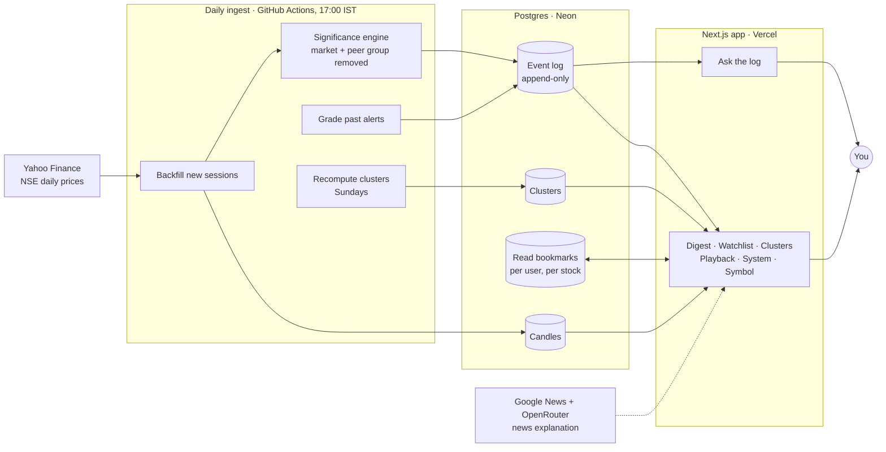

# Ledger

Most watchlists show you the current price and leave you to work out what
changed. Ledger shows you **what changed since you last looked** — and
only the changes that mean something.

**Live demo:** [ledger-diff.vercel.app](https://ledger-diff.vercel.app) · click **Try as Guest** — no sign-up, you get a ready-made watchlist and a short guided tour.


## The two ideas

**1. A bookmark, not a snapshot.** Everything that happens to a stock is
written to a permanent, append-only log. You hold a bookmark per stock
saying how far you've read. "What's new" is simply everything after your
bookmark. Marking something seen moves the bookmark forward — and since
bookmarks only ever move forward, your phone and laptop can never disagree
about what you've already read.

**2. "Moved" isn't the same as "mattered".** If the whole market falls 2%
and your stock falls 2%, nothing happened to *your stock*. Ledger subtracts
what the market and the stock's peer group already explain, and only flags
what's left over — and only when that leftover is unusual *for this
particular stock*, confirmed by trading volume. Most days nothing clears
the bar, and that's the product working.

## How it fits together



Every stock is ingested and scored **once**, no matter how many people
watch it. The only thing that grows per user is a few tiny bookmark rows —
so adding users barely touches the cost of running it.

**How a price becomes a card:** new day's candle → subtract the market's
and the peer group's move → compare the leftover to this stock's own
normal range (a z-score) → check volume backs it up → if it clears the bar,
write one event with a plain-English sentence attached → it shows up in
your digest until you mark it seen.

## What's in it

### Digest — "What's new"


- Every card leads with a **sentence**, not a ticker and a percentage.
  **Simple** mode keeps it plain; **Detailed** shows the numbers behind it.
- Four always-visible metrics per card (volume, move vs. peers, z-score,
  signal type), and a **breakdown** you can read in English or Hindi —
  only the words are translated, never the numbers.
- Grouped by recency — **Today**, **This week**, **Earlier**. Being away
  four months gives you one line per stock, not thousands of events.
- **Mark seen** moves your bookmark on the server, so it holds across devices.
- Old alerts get **graded afterwards** — "flagged 12 days ago, fully
  reverted since" — plus a running score of how past alerts held up.
- When nothing's flagged, **Show me anyway** scores each of your stocks and
  shows how close it came to the bar.
- **Find possible explanation** searches dated news for a flagged move and
  summarizes only what those articles say, with the source link.

### Ask the log


Ask "why is my portfolio red today?" and get an answer built from the event
log — every sentence comes from a stored event, with links to the stocks
underneath.

### Watchlist


- **Search to add** by ticker or company name — "tata" finds Tata Power.
- Per stock: price, today's move (highlighted when it cleared the
  bar, not just when it's red), a chart, volume, and a price range labeled
  by how much history is loaded.
- The chart's **dots** mark days a move was flagged; the **dotted
  line** is your bookmark, and the line after it only turns color when
  something significant happened since.
- **Personal reminders** — "tell me if this moves more than 2%" — shown in
  the top-right bell on every page, styled separately so they never look
  like the engine's own judgment.
- Add and remove both have **undo**.

### Clusters


Stocks grouped by how they **move together** over the past 90
sessions — not by sector labels. Each group lists its members by how far
they've drifted from the group today, and **Why grouped?** shows the
correlation numbers. Falls back to sector grouping when there isn't enough
history yet.

### Playback


Rewind to any past day and see exactly what the digest and clusters looked
like — rebuilt from the event log, not a recording. Buttons to step a day
forward or jump straight to the next flagged move.

### Also
- **Symbol page** — a stock's own events, its cluster, and a data status
  (fresh, stale, or unavailable), plus a low-liquidity tag on thin-volume
  days. Staleness counts only **market-open hours**, so a Friday close
  isn't "3 days stale" on Monday.
- **System page** — each stock's latest ingestion outcome.
- **Guided tour**, light/dark theme, and stock splits handled correctly
  (KOTAKBANK's 5:1 split doesn't show up as an 80% crash).

## Data

- **Prices:** ~220 NSE sessions for 39 stocks plus NIFTY, from Yahoo
  Finance.
- **Updates:** a GitHub Action adds each new session daily, after the
  close.
- **Splits:** KOTAKBANK's 5:1 split on 2026-01-14 is in the data and
  adjusted for.

**Where an LLM is used.** Only in **Find possible explanation**, to
summarize news articles that were already found — never to decide what's
significant or to predict prices. Clustering and significance are plain
statistics, on purpose: a confidently wrong answer about *why your money
moved* is worse than "nothing cleared the bar."

## Known limitations

- **NSE holidays aren't modeled** — only Mon–Fri, 09:15–15:30 IST.
- **Z-scores are relative to each stock's own recent history**, so they
  rank what deserves attention — they aren't comparable volatility figures
  across stocks.
- **One ingestion process at a time.** Every write is idempotent, so a
  second one wouldn't corrupt anything, but scaling to thousands of stocks
  means splitting stocks across workers.

## Tech

Next.js (App Router, TypeScript) · Postgres on Neon, plain SQL, no ORM ·
Vercel · GitHub Actions · Vitest (188 tests, no database needed:
`npx vitest run`) · driver.js for the tour.

The full technical write-up — schema, the significance math, clustering,
every failure mode and scaling path — is in
[`ARCHITECTURE.md`](ARCHITECTURE.md).

## Run it locally

```bash
npm install && cp .env.example .env
docker compose up -d db && npm run db:migrate
npm run seed && npm run sync-symbols && npm run sync-corporate-actions \
  && npm run clusters:recompute && npm run seed-demo-user
npm run backfill    # ingests every session in one pass
npm run dev
```

Price history is committed, so this works out of the box.
Optional features and flags are listed in `.env.example`; setup notes and
troubleshooting are in [`LOCAL.md`](LOCAL.md).
