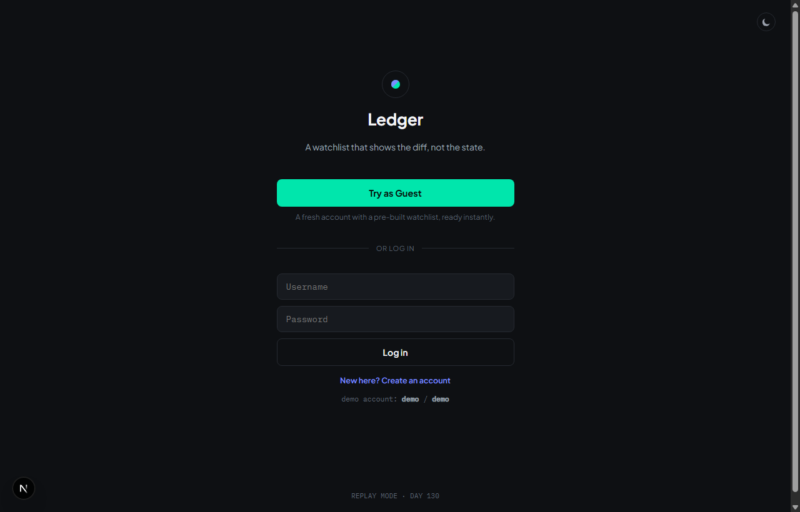
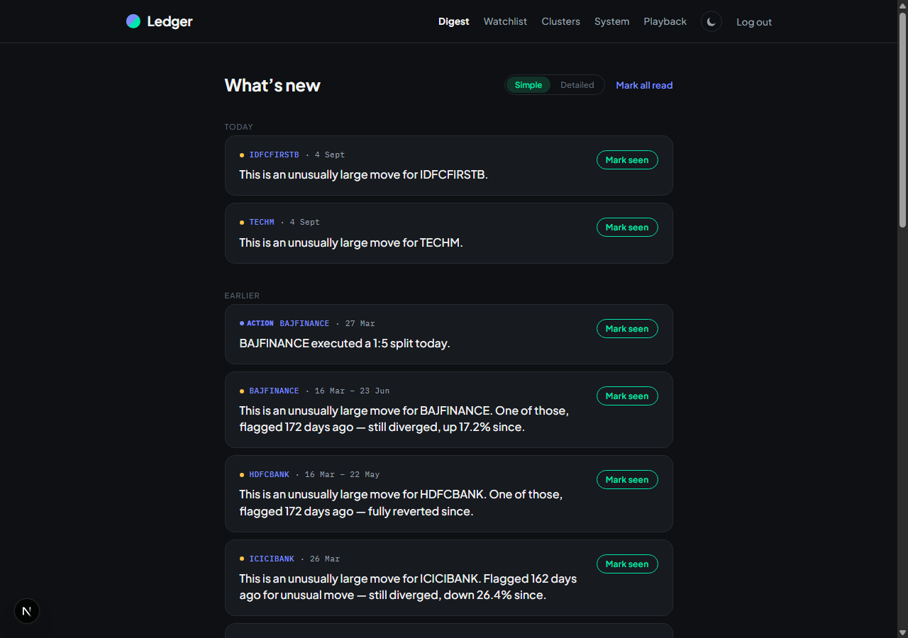
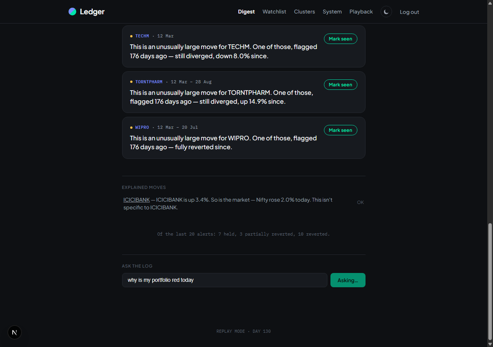
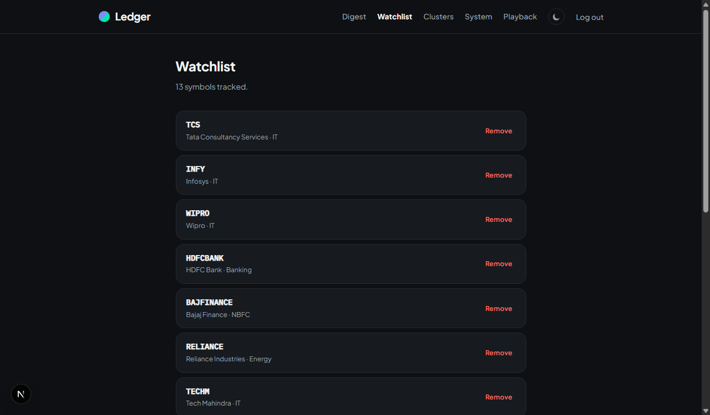
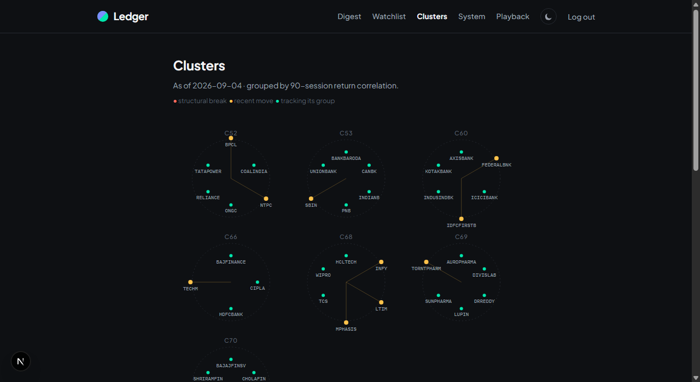
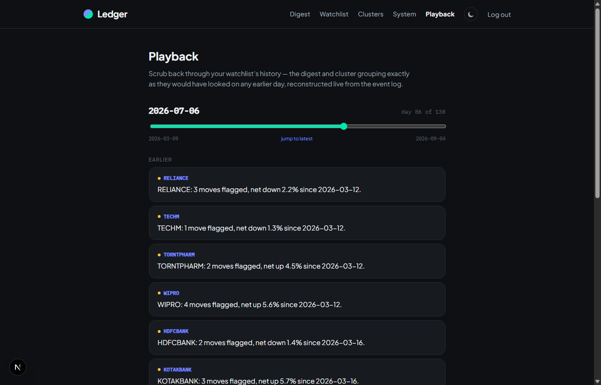

# Ledger

Most watchlists show current state and leave you to work out what
changed. Ledger shows the diff.

**Live demo:** [since-alpha.vercel.app](https://since-alpha.vercel.app) · **Try it:** click "Try as Guest" — no sign-up, instant seeded account.



## The idea, in two bets

**1. Read-cursor model.** Every symbol writes into an append-only event
log; every user holds a per-symbol read offset. "What's new" is
`log[since your offset:]`, computed on read — not fetched-as-state and
diffed in the UI. Reading advances the cursor explicitly, never
implicitly, so multi-device sync isn't a feature bolted on afterward —
it falls straight out of the data model.

**2. Structural break, not price move.** A 12-stock watchlist is usually
three or four correlated bets, not twelve independent ones. A move fully
explained by the market or the sector isn't news — the unexplained
residual is. Most days, nothing clears that bar, and that's the product
working, not a fallback screen.

## What it actually does



Every card leads with a sentence, not a ticker and a percentage —
toggle to **Detailed** and see the real math behind it (residual after
subtracting market and cluster movement, confirmed by volume). Click
**Mark seen** and it's a real cursor acknowledgment sent to the server,
not a local checkbox — two devices can never un-read each other.

Not every big move is news, and the last 20 alerts get graded after the
fact — "flagged 172 days ago, still diverged" — so the product keeps
score on itself instead of leaving stale alerts sitting there forever.
Below that, **Ask the log** answers plain-English questions ("why is my
portfolio red today?") by retrieving straight from the real event log —
no LLM call, no hallucination risk, every answer traceable to its source:



A watchlist is a real, personal list — add or remove any symbol, any time:



And the real thesis: symbols aren't independent. Correlation clustering
groups the ones that actually move together, with the real numbers one
click away on "Why grouped?":



**Playback** reconstructs the digest and cluster grouping exactly as
they looked on any earlier day — live from the event log, not a separate
recording:



## Under the hood

Next.js (App Router, TS) + Postgres (plain SQL, no ORM) + a standalone
long-lived Node worker for ingestion — real two-source conflict
detection, corporate-action adjustment (splits/bonuses), tiered polling,
retrospective alert grading, all inspectable live at `/system`.

Full technical write-up (schema, significance engine, clustering math,
resilience cases, deployment) is in [`ARCHITECTURE.md`](ARCHITECTURE.md).

## Run it locally

```bash
npm install && cp .env.example .env
docker compose up -d db && npm run db:migrate
npm run seed && npm run sync-symbols && npm run sync-corporate-actions \
  && npm run clusters:recompute && npm run seed-demo-user
npm run worker    # let it run ~20-30s, then Ctrl+C
npm run dev
```

Full setup notes, troubleshooting, and a click-through feature checklist:
[`LOCAL.md`](LOCAL.md).
